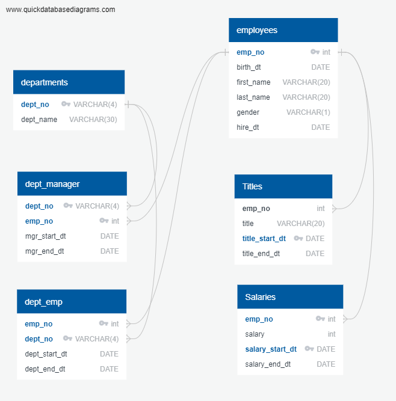
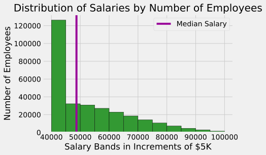
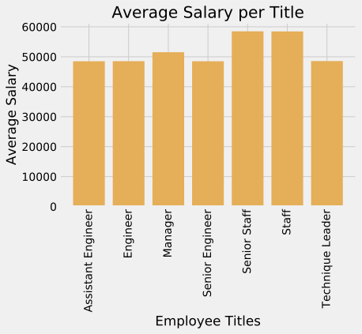

# Week 09 -  Employee Database: A Mystery in two Parts  <!-- omit in toc -->

- [Background](#background)
- [Section 1 - Data Modeling](#section-1---data-modeling)
- [Section 2 - Data Engineering](#section-2---data-engineering)
- [Section 3 Data Analysis.](#section-3-data-analysis)
- [Section 4.0 Bonus Section](#section-40-bonus-section)

## Background

In this assignment, I was to take 6 csv files and look at employees of a fictional company Pewlett Hackard. I was to do the following:
 - Data Modeling
 - Data Engineering
 - Data Analysis

## Section 1 - Data Modeling

I inspected the CSVs and sketched out an ERD of the tables.
I used freeware at quickdatabasedesigns.com in order to create an ERD regarding the SQL database.  I assigned primary keys, along with foreigns keys relating back to employees.emp_no and departments.dept_no. 
Here is the results of the ERD:

## Section 2 - Data Engineering

For this section, I used the results of the ERD to create a file DataEngineering.sql which can be found in the EmployeeSQL file folder.  
This file will drop any tables previously created, if necessary, and then (re)create the six tables needed for the rest of the assignment.  
The user will have to provide those six tables or request it from the owner of this repository.  
I used PGAdmin4 in order to finish importing the files.

## Section 3 Data Analysis.

All eight analysis have been carefully coded into the DataAnalysis.sqlfile. 
Each analysis also creates a view which can be seen in the SQL-Database.

## Section 4.0 Bonus Section

Finally I take a deeper dive in the data, transferring SQL tables over into distinct Pandas DataFrames  focused on the salaries class. 
Two charts are made: a histogram of salaries grouped in bands of $5K, an a look at average salaries by job title.  
Here's the historgram:

Here's the average salary chart:

Finally,  the jist of the joke was made clear. April Fools to you too.  In July.
